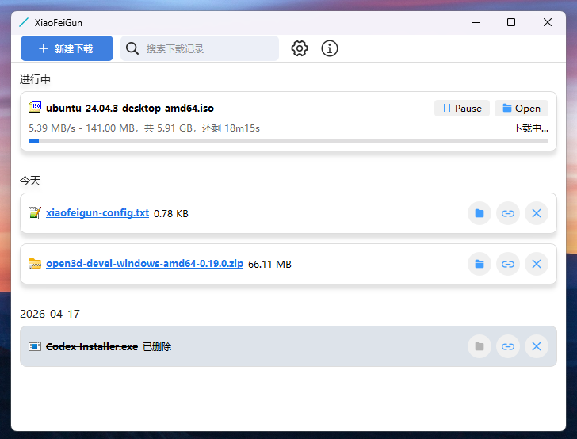

# XiaoFeiGun 

**Windows下基于aria2的下载软件, 易用免配置, 支持 HTTP/HTTPS、FTP、SFTP、磁力链接（Magnet）与 BT 种子下载。**

<!-- 徽章区域：提升项目专业度和可信度 -->

[**📥 前往下载最新版**](https://github.com/xfgdck/XiaoFeiGun/releases) | [**🐛 反馈问题/提交建议**](https://github.com/xfgdck/XiaoFeiGun/issues)

### 主要特性
**免配置**：已内嵌高效配置，无需手动设置，开箱即用。  
**多线程**：利用 aria2 的多连接机制，自动提升下载速度。  
**高并发**：同时处理多个下载任务，互不影响。  
**下载接管**：接管 Chrome 下载任务，可断点续传。  
**网络代理**：复杂网络环境下依然保持高速稳定连接。  
**自动更新 BT Tracker**：保持最新 tracker 列表，提高 BT/Magnet 任务连接效率。  

### 应用截图

### 使用方法
[点击这里下载 XiaoFeiGun 最新版本](https://github.com/xfgdck/XiaoFeiGun/releases)，双击安装即可开始使用。

